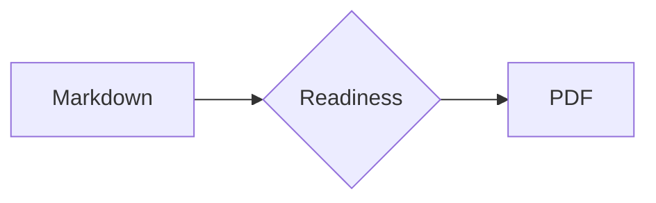
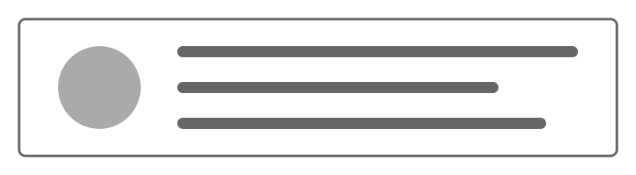

# 1. Text and Paragraphs

This shared input mixes English, 日本語, digits 0123456789, and symbols “”—… in one place.

## 1.1 Regular paragraph

This paragraph checks line height, letter spacing, and margins. The quick brown fox jumps over the lazy dog, and the five boxing wizards jump quickly.

## 1.2 Emphasis

*emphasis*, **strong**, ***strong emphasis***, ~~strikethrough~~, and **“emphasis with quotation marks”** in running text.

## 1.3 Inline code

Check `const value = 42` and the long identifier `previewRendererKeepsLongInlineCodeVisibleWithoutClipping`.

## 1.4 Links

[pfpdf](https://github.com/pfnet-research/pfpdf) / https://vivliostyle.org/

15-character boundary: `abcdefghijklmno` / 16-character boundary: abcdefghijklmnop

Long URL: https://example.invalid/reports/2026/template-preview/long-document-name?include=typography,tables,code,math&format=print-quality-pdf

Long identifiers: previewRendererKeepsLongIdentifiersVisible123456789 / preview_renderer_keeps_long_identifiers_visible_123456789

## 1.5 Blockquote

> This quotation checks indentation and wrapping. The quick brown fox jumps over the lazy dog.

# 2. Lists

## 2.1 Bulleted list

- A short item
- A longer item that checks wrapping behavior; mixing English words and 日本語 should still keep the second line aligned with the first
- The final item

## 2.2 Numbered list

1. Read the input
2. Assemble the HTML
3. Validate the PDF

## 2.3 Nesting

- Parent item
  - Child item
    1. Numbered grandchild item
    2. Another item

## 2.4 Task list

- [x] A completed check
- [ ] An unfinished check

## 2.5 Emphasis inside a blockquote

> **Emphasized quotation:** checks color, boldness, and rules inside quotations.

# 3. Tables

## 3.1 Basic table

| Item | Left | Center | Right |
|---|:---|:---:|---:|
| Alpha | left | center | 1,234 |
| Beta | a description that may wrap onto two lines | B | 56,789 |

## 3.2 Table with many columns

| ID | Status | Owner | Start | End | Count | Ratio | Long notes column |
|---:|:---:|---|---|---|---:|---:|---|
| 001 | Done | Alice | 2026-07-01 | 2026-07-03 | 120 | 98.5% | A sentence that should wrap naturally in a narrow cell without overlapping its neighbors. |
| 002 | Active | Bob | 2026-07-04 | 2026-08-15 | 2,048 | 67.0% | A fairly long description mixing English words and 日本語 in one cell. |
| 003 | Hold | Carol | 2026-08-01 | — | 9 | 12.5% | Contains a URL-like long string example.invalid/reports/2026/template-preview/overflow-check for wrapping. |

## 3.3 Long strings in narrow cells

| Kind | Value | Owner | Status |
|---|---|---|---|
| URL | https://example.invalid/a/very/long/path/to/report?format=pdf&language=en | Alice | Reviewing |
| ID | narrowTableCellIdentifierWithNumbers123456789 | Bob | Done |

## 3.4 Table with many rows

| No. | Input | Expected result | Notes |
|---:|---|---|---|
| 01 | heading | added to the TOC | level 1 |
| 02 | paragraph | renders a paragraph | English |
| 03 | emphasis | renders emphasis | inline |
| 04 | list | renders markers | nested |
| 05 | table | renders cells | aligned |
| 06 | code | highlighted | TypeScript |
| 07 | math | renders SVG | display |
| 08 | image | registers assets | local SVG |
| 09 | raw HTML | keeps elements | trusted |
| 10 | page break | breaks the page | directive |
| 11 | link | renders anchors | external |
| 12 | task | renders checkboxes | GFM |

# 4. Code and Math

## 4.1 TypeScript

```typescript
interface PreviewResult {
  template: string;
  pages: number;
  warnings: readonly string[];
}

export function summarize(result: PreviewResult): string {
  const label = `${result.template}: ${result.pages} pages`;
  return result.warnings.length === 0
    ? label
    : `${label} (${result.warnings.join(', ')})`;
}
```

## 4.2 A long code line

```text
GET /api/v1/template-preview/reports/2026/08/04?include=typography,tables,code,math,images,raw-html&format=print-quality-pdf HTTP/1.1
```

## 4.3 A long code block

```text
01  prepare input and metadata
02  parse GitHub Flavored Markdown
03  normalize heading anchors
04  build the table of contents
05  resolve template slots
06  collect local resources
07  rewrite stylesheet URLs
08  wait for fonts and images
09  paginate with Vivliostyle
10  validate the generated PDF
11  commit output atomically
12  render selected preview pages
13  upload CI artifacts
14  inspect cover and typography
15  inspect both contents pages
16  inspect dense feature content
```

## 4.4 Inline math

The quadratic formula is $x = \frac{-b \pm \sqrt{b^2 - 4ac}}{2a}$.

## 4.5 Display math

$$
\int_{-\infty}^{\infty} e^{-x^2} \, dx = \sqrt{\pi}
$$

## 4.6 Mermaid



___

# 5. Images and HTML

## 5.1 Image



## 5.2 Keyboard keys

Raw HTML renders <kbd>Ctrl</kbd> + <kbd>Enter</kbd>, subscript H<sub>2</sub>O, and superscript x<sup>2</sup>.

## 5.3 details element

<details open>
  <summary>An open details element</summary>
  <p>Checks the summary, body text, and marker placement.</p>
</details>

## 5.4 Inline style

Placing a <span style="border: 1px solid currentColor; padding: 0.15em 0.4em;">short framed element</span> inside running text.

## 5.5 Unicode

Hiragana ひらがな, katakana カタカナ, kanji 漢字, ＡＢＣ, ①, →, ✓, ©, αβγ, and 🙂.

## 5.6 Text after an image

Checks that the image and the following paragraph do not overlap.

# 6. Page Layout

## 6.1 Heading level 2

### 6.1.1 Heading level 3

#### 6.1.1.1 Heading level 4

##### 6.1.1.1.1 Heading level 5

###### 6.1.1.1.1.1 Heading level 6

## 6.2 End of page

## 6.3 Top of page

## 6.4 Final checks

### 6.4.1 Top margin

#### 6.4.1.1 Bottom margin

##### 6.4.1.1.1 Running header

###### 6.4.1.1.1.1 Footer

## 6.5 Page numbers

### 6.5.1 Orphaned headings

#### 6.5.1.1 End of document

Checks that headings stay on the same page as the following text and that the end of the document is not truncated.

# 7. Bibliography

This paragraph checks a single citation\cite{commonmark2024} and multiple citations\cite{citationjs2019,vivliostyle2026}, their numbering, wrapping, and internal links. Re-citing the same reference\cite{citationjs2019} yields multiple back links.

\printbibliography
