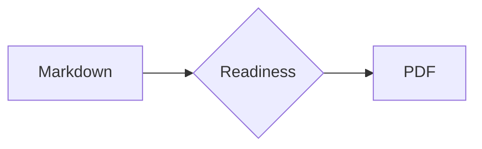

# 1. 文字と段落

日本語、English、数字 0123456789、記号「」―…を含む共通入力です。

## 1.1 通常の段落

行間、字間、余白を確認します。

## 1.2 強調

*emphasis*、**strong**、***strong emphasis***、~~取り消し線~~、これは**「日本語の強調」**です。

## 1.3 インラインコード

`const value = 42` と長い識別子 `previewRendererKeepsLongInlineCodeVisibleWithoutClipping` を確認します。

## 1.4 リンク

[pfpdf](https://github.com/pfnet-research/pfpdf) / https://vivliostyle.org/

15文字境界: `abcdefghijklmno` / 16文字境界: abcdefghijklmnop

長いURL: https://example.invalid/reports/2026/template-preview/long-document-name?include=typography,tables,code,math&format=print-quality-pdf

長い識別子: previewRendererKeepsLongIdentifiersVisible123456789 / preview_renderer_keeps_long_identifiers_visible_123456789

## 1.5 引用

> 引用文のインデントと折り返しを確認します。The quick brown fox jumps over the lazy dog.

# 2. リスト

## 2.1 箇条書き

- 短い項目
- 折り返しを確認するための長い項目。日本語と English words を混在させても二行目の開始位置が揃うことを確認します
- 最後の項目

## 2.2 番号付きリスト

1. 入力を読む
2. HTMLを組み立てる
3. PDFを検証する

## 2.3 ネスト

- 親項目
  - 子項目
    1. 孫の番号付き項目
    2. もう一つの項目

## 2.4 タスクリスト

- [x] 完了した確認
- [ ] 未完了の確認

## 2.5 引用内の強調

> **強調された引用:** 引用内の色、太字、罫線を確認します。

# 3. 表

## 3.1 基本の表

| 項目 | 左揃え | 中央揃え | 右揃え |
|---|:---|:---:|---:|
| Alpha | left | center | 1,234 |
| Beta | 二行に折り返す可能性がある説明 | B | 56,789 |

## 3.2 列数が多い表

| ID | 状態 | 担当 | 開始日 | 終了日 | 件数 | 割合 | 長い備考欄 |
|---:|:---:|---|---|---|---:|---:|---|
| 001 | 完了 | Alice | 2026-07-01 | 2026-07-03 | 120 | 98.5% | 列幅が狭い場合に自然に折り返され、隣のセルと重ならないことを確認する文章です。 |
| 002 | 進行中 | Bob | 2026-07-04 | 2026-08-15 | 2,048 | 67.0% | English words and 日本語を含む比較的長い説明を表示します。 |
| 003 | 保留 | Carol | 2026-08-01 | — | 9 | 12.5% | URL相当の長い文字列 example.invalid/reports/2026/template-preview/overflow-check を含みます。 |

## 3.3 狭いセルの長い文字列

| 種別 | 値 | 担当 | 状態 |
|---|---|---|---|
| URL | https://example.invalid/a/very/long/path/to/report?format=pdf&language=ja | Alice | 確認中 |
| ID | narrowTableCellIdentifierWithNumbers123456789 | Bob | 完了 |

## 3.4 行数が多い表

| No. | 入力 | 期待結果 | 備考 |
|---:|---|---|---|
| 01 | heading | 目次へ追加 | level 1 |
| 02 | paragraph | 段落を生成 | 日本語 |
| 03 | emphasis | 強調を生成 | inline |
| 04 | list | markerを生成 | nested |
| 05 | table | cellを生成 | aligned |
| 06 | code | highlight | TypeScript |
| 07 | math | SVGを生成 | display |
| 08 | image | assetを登録 | local SVG |
| 09 | raw HTML | 要素を保持 | trusted |
| 10 | page break | 改ページ | directive |
| 11 | link | anchorを生成 | external |
| 12 | task | checkboxを生成 | GFM |

# 4. コードと数式

## 4.1 TypeScript

```typescript
interface PreviewResult {
  template: string;
  pages: number;
  warnings: readonly string[];
}

export function summarize(result: PreviewResult): string {
  const label = `${result.template}: ${result.pages} pages`;
  return result.warnings.length === 0
    ? label
    : `${label} (${result.warnings.join(', ')})`;
}
```

## 4.2 長いコード行

```text
GET /api/v1/template-preview/reports/2026/08/04?include=typography,tables,code,math,images,raw-html&format=print-quality-pdf HTTP/1.1
```

## 4.3 長いコードblock

```text
01  prepare input and metadata
02  parse GitHub Flavored Markdown
03  normalize heading anchors
04  build the table of contents
05  resolve template slots
06  collect local resources
07  rewrite stylesheet URLs
08  wait for fonts and images
09  paginate with Vivliostyle
10  validate the generated PDF
11  commit output atomically
12  render selected preview pages
13  upload CI artifacts
14  inspect cover and typography
15  inspect both contents pages
16  inspect dense feature content
```

## 4.4 インライン数式

二次方程式の解は $x = \frac{-b \pm \sqrt{b^2 - 4ac}}{2a}$ です。

## 4.5 ディスプレイ数式

$$
\int_{-\infty}^{\infty} e^{-x^2} \, dx = \sqrt{\pi}
$$

## 4.6 Mermaid



___

# 5. 画像とHTML

## 5.1 画像


## 5.2 キー表示

raw HTMLによる <kbd>Ctrl</kbd> + <kbd>Enter</kbd>、下付きのH<sub>2</sub>O、上付きのx<sup>2</sup>を表示します。

## 5.3 details要素

<details open>
  <summary>開いたdetails要素</summary>
  <p>summary、本文、markerの位置を確認します。</p>
</details>

## 5.4 インラインstyle

<span style="border: 1px solid currentColor; padding: 0.15em 0.4em;">枠付きの短い要素</span>を本文中に置きます。

## 5.5 Unicode

ひらがな、カタカナ、漢字、ＡＢＣ、①、→、✓、©、αβγ、🙂を表示します。

## 5.6 画像後の文章

画像と後続文が重ならないことを確認します。

# 6. ページ構成

## 6.1 見出しレベル2

### 6.1.1 見出しレベル3

#### 6.1.1.1 見出しレベル4

##### 6.1.1.1.1 見出しレベル5

###### 6.1.1.1.1.1 見出しレベル6

## 6.2 ページ末尾

## 6.3 ページ先頭

## 6.4 最終確認

### 6.4.1 上余白

#### 6.4.1.1 下余白

##### 6.4.1.1.1 Running header

###### 6.4.1.1.1.1 Footer

## 6.5 ページ番号

### 6.5.1 見出しの孤立

#### 6.5.1.1 文書末尾

見出しと後続本文が同じページに保たれ、文書末尾が欠落しないことを確認します。

# 7. 参考文献

本文中の単一引用\cite{commonmark2024}と、複数引用\cite{citationjs2019,vivliostyle2026}の番号、折り返し、内部リンクを確認します。同じ文献の再引用\cite{citationjs2019}には複数の戻りリンクが付きます。

\printbibliography
