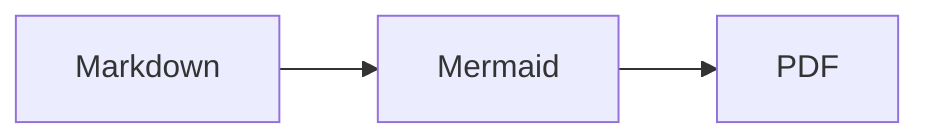

# 5. Math and Code Highlighting

pfpdf bundles everything needed for math and syntax highlighting. After the initial browser download, these features work without network access.

## 5.1 Inline math

Text enclosed in `$...$` becomes inline math. Do not put whitespace immediately after the opening `$` or immediately before the closing `$`, and do not let the expression span a line break.

```md
The solutions of a quadratic equation are $x = \frac{-b \pm \sqrt{b^2 - 4ac}}{2a}$.
```

The solutions of a quadratic equation are $x = \frac{-b \pm \sqrt{b^2 - 4ac}}{2a}$.

## 5.2 Display math

Text between `$$` delimiters on separate lines becomes display math. A delimiter on the same line as the expression does not start a display-math block.

```md
$$
\int_{-\infty}^{\infty} e^{-x^2} \, dx = \sqrt{\pi}
$$
```

If the closing `$$` is missing, no math block is started and the content is treated as regular text. If MathJax reports a TeX syntax error, pfpdf fails with exit code `2` rather than leaving behind a PDF containing the broken math.

$$
\int_{-\infty}^{\infty} e^{-x^2} \, dx = \sqrt{\pi}
$$

## 5.3 A `$` that should not become math

To keep a `$` in ordinary prose from becoming math, escape it as `\$`.

```md
The price is \$100.
```

## 5.4 Code highlighting

Add a language name to a fenced code block to enable syntax highlighting.

````md
```python
def greet(name: str) -> str:
    return f"Hello, {name}!"
```
````

```python
def greet(name: str) -> str:
    return f"Hello, {name}!"
```

Other languages work the same way.

```typescript
export function add(a: number, b: number): number {
  return a + b;
}
```

If you omit the language name, you get a plain code block without highlighting. If you specify an unknown language name, the code itself is kept and displayed as plain text, and a warning is emitted.

```
a plain text block
```

## 5.5 Mermaid diagrams

A fenced code block with the language name `mermaid` is rendered as a diagram. The Mermaid runtime itself is bundled with pfpdf, so no CDN connection is required.

````md

````


pfpdf renders Mermaid diagrams to SVG during Markdown conversion. It stores each SVG as a standalone image in the build workspace, and Vivliostyle lays the vector image out on the page. If a diagram contains a syntax error, pfpdf reports the source file and line and exits with code `2` instead of placing unrendered source in the PDF. A failure to load the bundled Mermaid runtime produces exit code `1`.

Flowchart edge labels such as `A -->|label| B` are currently unsupported, because server-side rendering misaligns the text and its background. If you need to describe an edge, express the description as a node label instead.

## 5.6 No conversion inside code blocks

Inside code blocks and inline code, notation such as `**strong**`, `$math$`, raw HTML, and `___` is never interpreted. This is handy when writing about the notation itself.
