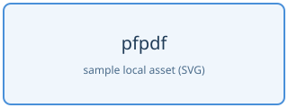

# 3. GFM の書き方

pfpdf の Markdown は GitHub Flavored Markdown(GFM)が基準です。GitHub で使える標準的な記法がそのまま使えます。この章の記法はすべて実際にこの PDF 上で変換されています。

## 3.1 見出しと段落

`#` から `######` までの Markdown 見出しが使えます。見出しには source 順で一意な anchor が付き、6 階層すべてが目次に載ります。同名見出しには `-2`、`-3` の suffix が付きます。raw HTML で直接書いた `h1` から `h6` は自動目次の対象ではなく、link target にする場合は `id` を明示します。

## 3.2 強調

*emphasis*、**strong emphasis**、~~strikethrough~~、および妥当な入れ子(***strong + emphasis***)が使えます。

### 日本語の強調

日本語の文中でも `**` はそのまま使えます。全角の句読点や括弧が隣接していても正しく変換されます。

- これは**重要**です。
- これは**「強調表示」**の例です。
- これは**重要な点。**続きのテキストも書けます。
- ここは**（重要事項）**です。

`<strong>` タグを書く必要はありません。まず `**` を使ってください。

## 3.3 リスト

ネストしたリスト、番号付きリスト、task list が使えます。

- 果物
  - りんご
  - みかん
    1. 温州みかん
    2. ポンカン
- 野菜

- [x] 完了したタスク
- [ ] 未完了のタスク

## 3.4 表

表は raw HTML ではなく GFM の table 記法を推奨します。列の揃えも指定できます。

| 項目 | 左揃え | 中央 | 右揃え |
|---|:---|:---:|---:|
| A | left | center | 100 |
| B | left | center | 2,000 |

## 3.5 リンクと画像

- inline link: [Vivliostyle](https://vivliostyle.org/)
- autolink: https://commonmark.org/ のように URL をそのまま書くとリンクになります
- 画像: `` のように相対パスで指定します



### 長い URL と識別子

16 grapheme以上の URL、メールアドレス、path、snake_case・kebab-case・camelCase の識別子には、表示時の改行候補が自動で入ります。URLの `/` や `?`、hostの `.`、識別子の区切りが優先されます。link先やコピーされる文字列に空白・zero-width文字は追加されません。

https://example.invalid/reports/2026/very-long-document-name?format=print&language=ja

inline codeとcode block、数式、`kbd`、`samp`の内容は完全保存を優先するため対象外です。codeの長い行はtemplateの既存の折り返し規則で表示されます。

## 3.6 引用とコード

> これは blockquote です。
> 複数行にわたって書けます。

inline code は `` `backtick` `` で囲みます。code block は 05 章を参照してください。

## 3.7 水平線

`---` または `***` で水平線(thematic break)になります。

---

indent なしの単独行 `___` は pfpdf では改ページ(02 章参照)に予約されているため、水平線には使えません。blockquote や list の内側、前後に空白がある場合、underscore が 4 個以上ある場合は改ページ記法になりません。

## 3.8 GFM に含まれない GitHub の機能

GitHub.com 上の一部の表示は GFM の仕様ではなく、GitHub のサービス固有の機能です。次は pfpdf では変換されません。

- `@user` の mention、`#123` の issue / pull request reference
- `:smile:` のような emoji shortcode
- `> [!NOTE]` などの alert

Mermaid は pfpdf の個別 extension として対応しています。05 章の `mermaid` fenced code block を参照してください。それ以外の機能が必要な場合は raw HTML(04 章)や画像で表現してください。

## 3.9 BibTeX 参考文献

先頭 Markdown の front matter で `.bib` file を指定します。相対 path は front matter を書いた Markdown の親 directory を基準にします。複数 file は list で指定できます。

```yaml
---
title: 調査報告
bibliography:
  - bibliography/references.bib
---
```

本文では TeX と同じ `\cite` command で BibTeX key を引用します。複数 key は comma で区切ります。

```md
先行研究\cite{smith2024}と比較研究\cite{smith2024,tanaka2025}を参照します。
```

引用は `[1]` のような番号になり、PDF 内の参考文献 entry への link が付きます。参考文献一覧を置く場所には、top-level の独立行として `\printbibliography` を書きます。通常の Markdown 見出しを直前に書けば目次にも載ります。

```md
# 参考文献

\printbibliography
```

`\printbibliography` を省略した場合は、一覧を文書末尾へ追加します。inline code、code block、raw HTML、数式内の `\cite` は文献引用として解釈しません。literal な使用例は `` `\cite{key}` `` のように inline code で書けます。引用の `\cite` を backslash でも escape する場合は `\\cite{key}` と書きます。

初期版は BibTeX / BibLaTeX の `.bib` と数値 style を扱います。存在しない key、重複 key、不正な BibTeX、読めない file は PDF を部分生成せず code `2` で失敗します。TeX の `\ref` は文献引用ではなく、将来の図表・数式・節参照用に予約しています。
