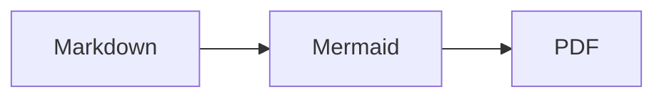

# 5. 数式とコードハイライト

数式とコードハイライトに必要なファイルは pfpdf の package に同梱されています。初回の browser 取得が済んでいれば、ネットワークなしで動作します。

## 5.1 inline 数式

`$...$` で囲むと inline 数式になります。開始 `$` の直後と終了 `$` の直前に空白は置かず、改行をまたがないようにします。

```md
二次方程式の解は $x = \frac{-b \pm \sqrt{b^2 - 4ac}}{2a}$ です。
```

二次方程式の解は $x = \frac{-b \pm \sqrt{b^2 - 4ac}}{2a}$ です。

## 5.2 display 数式

単独行の `$$` で囲むと display 数式になります。delimiter と式を同じ行に置く書き方は display 数式として扱いません。

```md
$$
\int_{-\infty}^{\infty} e^{-x^2} \, dx = \sqrt{\pi}
$$
```

閉じる `$$` がない場合は数式を開始せず、通常の text として扱われます。MathJax が TeX の構文エラーを報告した場合は、誤った数式を含む PDF を残さず終了 code `2` で失敗します。

$$
\int_{-\infty}^{\infty} e^{-x^2} \, dx = \sqrt{\pi}
$$

## 5.3 数式にしたくない `$`

通常の文章中の `$` を数式にしたくない場合は `\$` と escape します。

```md
価格は \$100 です。
```

## 5.4 コードハイライト

fenced code block の言語名を指定すると、syntax highlight されます。

````md
```python
def greet(name: str) -> str:
    return f"Hello, {name}!"
```
````

```python
def greet(name: str) -> str:
    return f"Hello, {name}!"
```

他の言語も同様です。

```typescript
export function add(a: number, b: number): number {
  return a + b;
}
```

言語名を省略すると highlight なしの plain な code block になります。未知の言語名を指定した場合も code 自体は残り、plain text 表示と warning になります。

```
plain text のブロック
```

## 5.5 Mermaid 図

言語名に `mermaid` を指定した fenced code block は図として描画されます。Mermaid 本体は pfpdf に同梱されているため、CDN への接続は不要です。

````md

````


Mermaid は Markdown 変換時に SVG へ描画されます。生成した SVG は build workspace 内の独立した画像として保持され、Vivliostyle がその vector image をページ組版します。Mermaid の構文エラーがある場合、未描画の source code を PDF に残して成功とはせず、source file / line を表示して終了 code `2` で失敗します。同梱 runtime 自体の読み込み失敗は終了 code `1` です。

`A -->|label| B`のようなflowchartのedge labelは、server-side描画で文字と背景の位置が一致しないため現在は未対応です。edgeの説明が必要な場合はnodeのlabelとして表現してください。

## 5.6 code block 内は変換されない

code block と inline code の中では、`**strong**`、`$math$`、raw HTML、`___` などの記法は一切解釈されません。記法の説明を書くときに便利です。
